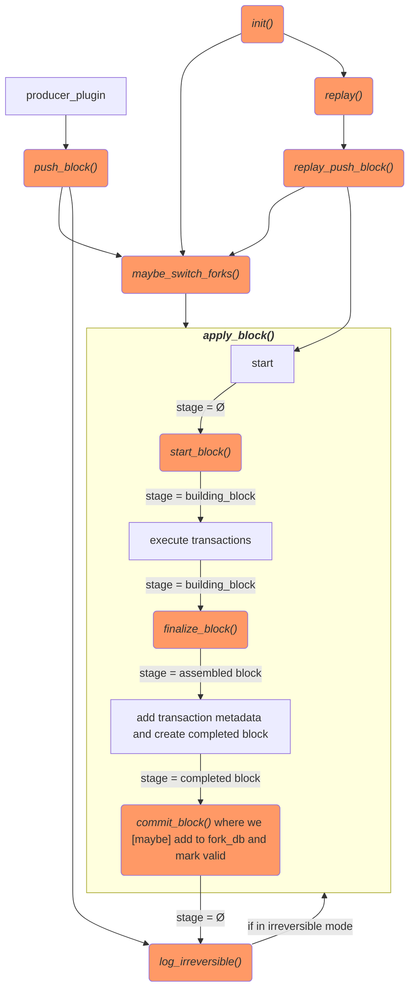

The following diagram describes Leap block production, as implemented in `libraries/chain/controller.cpp`:

```mermaid
flowchart TD
    pp[producer_plugin] --> D
    A("`_replay()_`"):::fun --> B("`_replay_push_block()_`"):::fun
    B --> E("`_maybe_switch_forks()_`"):::fun
    C("`_init()_`"):::fun ---> E
    C --> A
    D("`_push_block()_`"):::fun ---> E
    subgraph G["`**_apply_block()_**`"]
       direction TB
       start -- "stage = &Oslash;" --> sb
       sb("`_start_block()_`"):::fun -- "stage = building_block" --> et
       et["execute transactions" ] -- "stage = building_block" --> fb("`_finalize_block()_`"):::fun
       fb -- "stage = assembled block" --> cb["add transaction metadata and create completed block"]
       cb -- "stage = completed block" --> commit("`_commit_block()_ where we [maybe] add to fork_db and mark valid`"):::fun

    end
    B ----> start
    E --> G
    D --> F("`_log_irreversible()_`"):::fun
    commit -- "stage =  &Oslash;" -->  F
    F -- "if in irreversible mode" --> G

    classDef fun fill:#f96
```